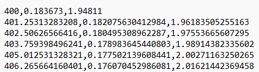
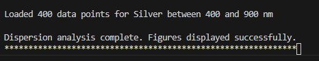
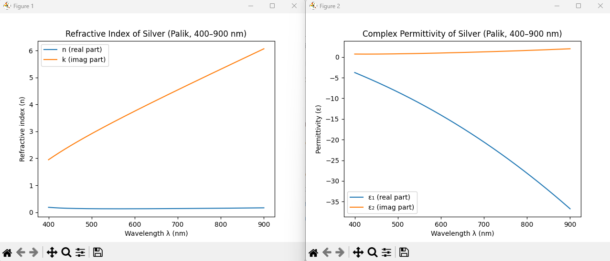

# Metal Dispersion Analyzer
A C++ program for dispersion analysis of metals (e.g., Ag, Au). The program loads wavelength-dependent refractive index (n) and extinction coefficient (k) data from a file, computes the complex permittivity ε = ε₁ + iε₂, and plots both refractive index and dielectric function curves.

---

## Features
- Loads wavelength-dependent refractive index (**n**) and extinction coefficient (**k**) data from a file
- Computes the real (**ε₁**) and imaginary (**ε₂**) parts of the complex permittivity
- Generates two plots:
    1. Refractive index (**n, k**) vs. wavelength
    2. Permittivity (**ε₁, ε₂**) vs. wavelength
- Designed as a base framework for future extensions (e.g., Fresnel analysis)


---

## Author
Fatemeh HadavandMirzaee

---

## Version History

- **v1.0 (9 November 2025)**  
  - Implemented data loading from a comma-separated text file  
  - Added computation of ε₁ = n² − k² and ε₂ = 2nk  
  - Integrated data visualization via `matplotlibcpp.h`  
  - Focused on material optical properties (dispersion analysis only)

---

## Inputs
The program accepts and loads comma-separated data from a text file containing three columns as shown below:
- **Wavelength** (in nanometers)
- **Refractive index (n)**
- **Extinction coefficient (k)**

To use the program, specify the full or relative path to the data file in the `loadData()` function of the program.
Below is an example showing a few lines of the input file:




## Before running
This program requires the `matplotlibcpp.h` header for data visualization. Make sure that:
- The header file `matplotlibcpp.h` is available in your project directory or in your compiler’s include path.
- Your system has **Python** with **Matplotlib** and **NumPy** installed, since `matplotlibcpp.h` relies on them for plotting.

If `matplotlibcpp.h` is not already present, you can download it from the following GitHub repository:
[official matplotlib-cpp GitHub repository](https://github.com/lava/matplotlib-cpp).


## Usage (Windows)
If you are on Windows, you can compile and run the program using the provided PowerShell build script.

```bash
<path_to_build_script>\build_plot.ps1 <path_to_project>\metal_dispersion.cpp
```
Replace both paths with the correct locations on your own computer.

**Example (on my computer):**

```bash 
C:\Users\ffmir\Desktop\cpp_projects\2025-11-07-metal-dispersion\tools\build_plot.ps1 C:\Users\ffmir\Desktop\cpp_projects\2025-11-07-metal-dispersion\metal_dispersion.cpp
``` 

**What this script does**
The PowerShell script `build_plot.ps1`:
- Calls the **g++** compiler to build `metal_dispersion.cpp`
- Links the program to **Python** for plotting through `matplotlibcpp.h`
- Runs the compiled .exe file so the plots appear automatically.


## Running the program and Example Output

When the program runs successfully:
- It prints the number of data points loaded (see below):

  

- Calculates the real and imaginary parts of `ε`,
- And displays two figures:
    1. `n` and `k` vs. wavelength
    2. `ε₁` and `ε₂` vs. wavelength




---

## Troubleshooting
If the plots do not appear:
- Ensure that **Python** is installed and accessible in your system path.
- Verify that **Matplotlib** and **NumPy** are installed 
```bash
pip install matplotlib numpy
```

- Confirm that the data file path in your code is correct.
- Confirm that the path to the PowerShell build script `(build_plot.ps1)` is entered correctly in the running command.
- Check that your PowerShell build script is set up correctly based on the **Template** provided in this repository tools folder (e.g., correct Python version, include and library paths).