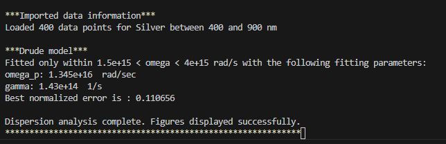
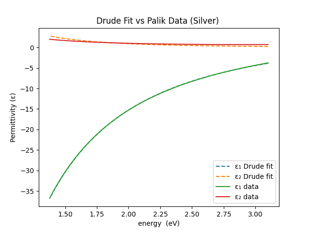

# Metal Dispersion Analyzer
A C++ program for dispersion analysis of metals (e.g., Ag, Au). The program loads wavelength-dependent refractive index (**n**) and extinction coefficient (**k**) data from a file, computes the complex permittivity ε = ε₁ + iε₂, and visualizes optical dispersion data. **Version 2.0 extends the analysis to the energy domain and introduces Drude model fitting.**

---

## Features
**Core functionality (Version 1.0 foundation)**
- Loads wavelength-dependent refractive index (**n**) and extinction coefficient (**k**) data from a file
- Computes the real (**ε₁**) and imaginary (**ε₂**) parts of the complex permittivity
- Generates two plots:
  1. Refractive index (**n, k**) vs. wavelength
  2. Permittivity (**ε₁, ε₂**) vs. wavelength
- Designed as a base framework for future extensions (e.g., Fresnel analysis)

**New in Version 2.0**
- Converts wavelength-domain data to: **Angular frequency (ω)** and **Photon energy (eV)**
- Visualizes ε₁ and ε₂ vs. **energy**
- Fits a **Drude free-electron model** to experimental permittivity data: `ε(ω) = ε∞ − ωp² / (ω² + iγω)`, and extracts **Plasma frequency (ωₚ)** and **damping rate (γ)**
- Compares Drude model predictions directly with experimental data in a plot
- Supports plot-level control (Basic vs Advanced):
  1. Basic: wavelength-domain plots (choosing Basic mode reproduces the plots from Version 1.0)
  2. Advanced: energy-domain plots and Drude fitting (enables the Version 2.0 energy-domain and Drude fitting plots.)

---

## Author
Fatemeh HadavandMirzaee

---

## Version History
- **v2.0 (3 January 2026)**
  - Added energy-domain permittivity analysis
  - Implemented Drude model fitting with normalized least-squares error
  - Introduced a configurable fitting window to exclude interband transitions
  - Enabled direct comparison of experimental/imported permittivity data and model results in the same plot
  - Improved numerical robustness and code structure

- **v1.0 (9 November 2025)**
  - Implemented data loading from a comma-separated text file
  - Added computation of `ε₁ = n² − k²` and `ε₂ = 2nk`
  - Integrated data visualization via matplotlibcpp.h
  - Focused on material optical properties (dispersion analysis only)

---

## Inputs
The program accepts and loads comma-separated data from a text file containing three columns as shown below:
- **Wavelength** (in nanometers)
- **Refractive index (n)**
- **Extinction coefficient (k)**

To use the program, specify the full or relative path to the data file in the loadData() function of the program.
Below is an example showing a few lines of the input file:


---

## Plot Modes
**Plot behavior is controlled in main() using:**
```cpp
// Set plot mode in main()
PlotLevel plotLevel = PlotLevel::Advanced;
```

Available modes
- Basic (validation mode)
  1. `n` and `k` vs. wavelength
  2. `ε₁` and `ε₂` vs. wavelength

- Advanced (default)
  1. `ε₁` and `ε₂` vs energy (eV): Drude model fit vs experimental/imported permittivity

The basic plots reproduce the results of Version 1.0 and are intended for data validation and educational purposes.

---

## Before running
This program requires the `matplotlibcpp.h` header for data visualization. Make sure that:
- The header file `matplotlibcpp.h` is available in your project directory or in your compiler’s include path.
- Your system has **Python** with **Matplotlib** and **NumPy** installed, since `matplotlibcpp.h` relies on them for plotting.

If `matplotlibcpp.h` is not already present, you can download it from the following GitHub repository:
[official matplotlib-cpp GitHub repository](https://github.com/lava/matplotlib-cpp).

## Usage (Windows)
If you are on Windows, you can compile and run the program using the provided PowerShell build script.

```bash
<path_to_build_script>\build_plot.ps1 <path_to_project>\metal_dispersion.cpp
```
Replace both paths with the correct locations on your own computer.

**Example (on my computer):**

```bash 
C:\Users\ffmir\Desktop\cpp_projects\2025-11-07-metal-dispersion\tools\build_plot.ps1 C:\Users\ffmir\Desktop\cpp_projects\2025-11-07-metal-dispersion\metal_dispersion.cpp
``` 

**What this script does**
The PowerShell script `build_plot.ps1`:
- Calls the **g++** compiler to build `metal_dispersion.cpp`
- Links the program to **Python** for plotting through `matplotlibcpp.h`
- Runs the compiled .exe file so the plots appear automatically.

---

## Example Output
- **Version 2.0 output (Drude Model Analysis)**

  When the program runs successfully:
  - Console output: The program prints:
    - the number of data points loaded
    - the fitting parameters, including plasma frequency (ωₚ) and damping rate (γ), obtained from fitting to the Drude model (see below):

      

  - Graphical output: The program:
    - Computes the real and imaginary parts of the complex permittivity (ε₁ and ε₂) from both:
      - the imported optical data, and
      - the fitted Drude model
    - Plots ε₁(E) and ε₂(E) as functions of photon energy, allowing direct comparison between imported data (solid line) and the Drude fit (dashed line)

      

- **Version 1.0 output (Wavelength-Domain Validation)**
When the program runs successfully:
  - Console output: It prints the number of data points loaded (see below):

    

  - Graphical output
    - Calculates the real and imaginary parts of  `ε`, and displays two figures:
      1. `n` and `k` vs. wavelength
      2. `ε₁` and `ε₂` vs. wavelength

      

---

## Troubleshooting
If the plots do not appear:
- Ensure that **Python** is installed and accessible in your system path.
- Verify that **Matplotlib** and **NumPy** are installed
```bash
pip install matplotlib numpy
```

- Confirm that the data file path in your code is correct.
- Confirm that the path to the PowerShell build script `(build_plot.ps1)` is entered correctly in the running command.
- Check that your PowerShell build script is set up correctly based on the **Template** provided in this repository tools folder (e.g., correct Python version, include and library paths).
